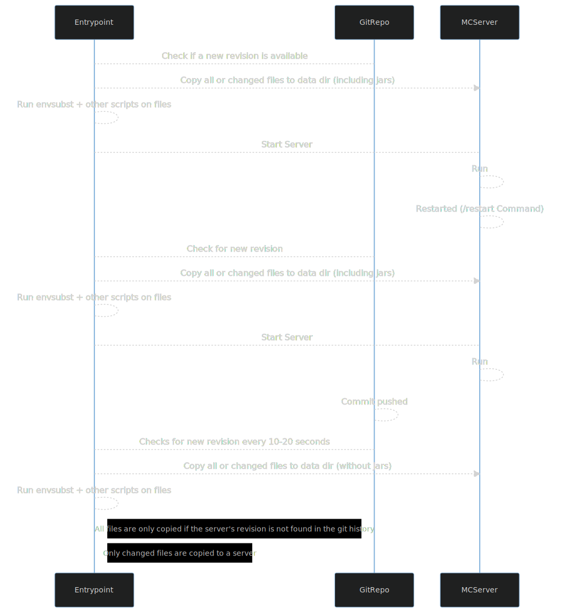

# k8s-minecraft

Minecraft in K8S because why not?

## Goals

Goal of this repo is to provide kind of easy to use container images to be used in Kubernetes.
In addition to container images, Helm Charts for Paper (can be used as a base for generic Minecraft Server) and Waterfall deployment.

## Helm Charts

The Helm charts default `values.yaml` assume that you agree to the Minecraft EULA.

## Flow



<details>
    <summary>Click to expand</summary>
    <p>

```mermaidjs
sequenceDiagram
  participant Entrypoint
  participant GitRepo
  participant MCServer

  Entrypoint --> GitRepo: Check if a new revision is available
  Entrypoint -->> MCServer: Copy all or changed files to data dir (including jars)
  Entrypoint --> Entrypoint: Run envsubst + other scripts on files
  Entrypoint --> MCServer: Start Server
  MCServer --> MCServer: Run
  MCServer --> MCServer: Restarted (/restart Command)
  Entrypoint --> GitRepo: Check for new revision
  Entrypoint -->> MCServer: Copy all or changed files to data dir (including jars)
  Entrypoint --> Entrypoint: Run envsubst + other scripts on files
  Entrypoint --> MCServer: Start Server
  MCServer --> MCServer: Run
  GitRepo --> GitRepo: Commit pushed
  Entrypoint --> GitRepo: Checks for new revision every 10-20 seconds
  Entrypoint -->> MCServer: Copy all or changed files to data dir (without jars)
  Entrypoint --> Entrypoint: Run envsubst + other scripts on files

  note left of GitRepo: All files are only copied if the server's revision is not found in the git history
  note right of Entrypoint: Only changed files are copied to a server
```
</p>
</details>

The "copying of files from the GitRepo to the MCServer" will have the following features:

* Variables in format `${VARIABLE}` are replaced in all config files.
* `yq` can be used for applying patch files to config files.
* Depending on if the server is running, `*.jar` files are not updated.
* Depending on if the server's revision is still available in the git history, only changed files are copied, otherwise "everything" is copied.
* A function to copy a map to the server, e.g., to easily have lobby servers their map always the same / updated after a restart. (_Not implemented yet_)

## Shoutouts

* Java Flags: https://aikar.co/2018/07/02/tuning-the-jvm-g1gc-garbage-collector-flags-for-minecraft/
