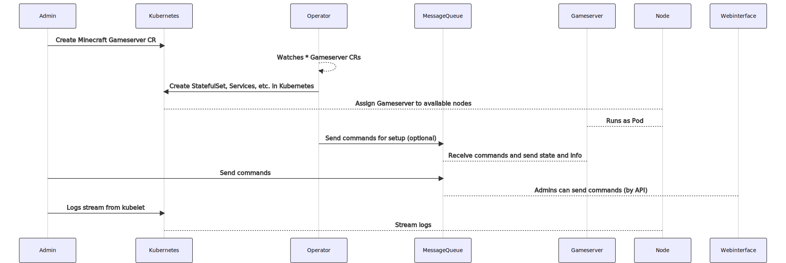

# k8s-minecraft

Minecraft in K8S because why not?

## Goals

- [ ] MinecraftServer Resource to run "an arbitrary" server (Spigot, Paper, Sponge, etc.) image in Kubernetes
- [ ] ProxyServer Resource to run "an arbitrary" proxy (Bungeecord, Waterfall, Velocity, etc.) image in Kubernetes
- [ ] Compact server / proxy process daemon in the containers
- [ ] Easy to use, as long as you have a Kubernetes cluster

## Architecture



<details>
    <summary>Click to expand</summary>
    <p>

```mermaidjs
sequenceDiagram
    participant Admin
    participant Kubernetes
    participant Operator
    participant MessageQueue
    participant Gameserver
    participant Node
    participant Webinterface
    Admin->>Kubernetes: Create Minecraft Gameserver CR
    Operator-->>Operator: Watches * Gameserver CRs
    Operator->>Kubernetes: Create StatefulSet, Services, etc. in Kubernetes
    Kubernetes-->Node: Assign Gameserver to available nodes
    Gameserver-->Node: Runs as Pod
    Operator->>MessageQueue: Send commands for setup (optional)
    Gameserver-->MessageQueue: Receive commands and send state and info
    Admin->>MessageQueue: Send commands
    Webinterface-->MessageQueue: Admins can send commands (by API)
    Admin->>Kubernetes: Logs stream from kubelet
    Kubernetes-->Node: Stream logs 
```
</p>
</details>

## Shoutouts

* Java Flags: https://aikar.co/2018/07/02/tuning-the-jvm-g1gc-garbage-collector-flags-for-minecraft/
